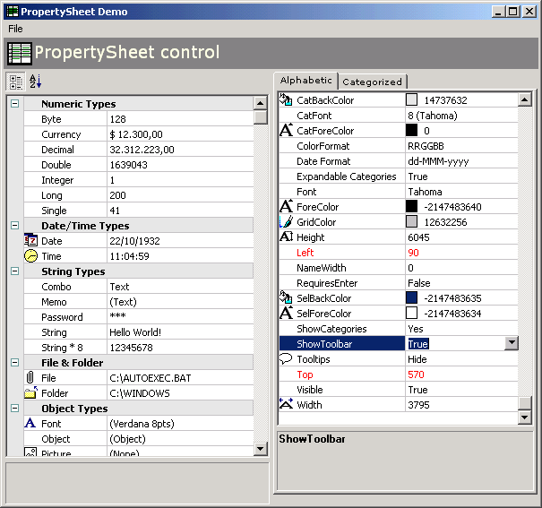



## Property Sheet 1\.4

### Description

PropertySheet control like VB Property window...very useful for handling properties and values in your applications...VERSION 1.4 RELEASED!!! New properties and several bug fix...Thanks Neal!
 
### More Info
 

             |
---                |---
**Submitted On**   |2004-04-15 18:33:26
**By**             |[Marclei V Silva](https://github.com/Planet-Source-Code/PSCIndex/blob/master/ByAuthor/marclei-v-silva.md)
**Level**          |Advanced
**User Rating**    |4.9 (74 globes from 15 users)
**Compatibility**  |VB 6\.0
**Category**       |[Custom Controls/ Forms/  Menus](https://github.com/Planet-Source-Code/PSCIndex/blob/master/ByCategory/custom-controls-forms-menus__1-4.md)
**World**          |[Visual Basic](https://github.com/Planet-Source-Code/PSCIndex/blob/master/ByWorld/visual-basic.md)
**Archive File**   |[Property\_S1734784182004\.zip](https://github.com/Planet-Source-Code/marclei-v-silva-property-sheet-1-4__1-52325/archive/master.zip)

